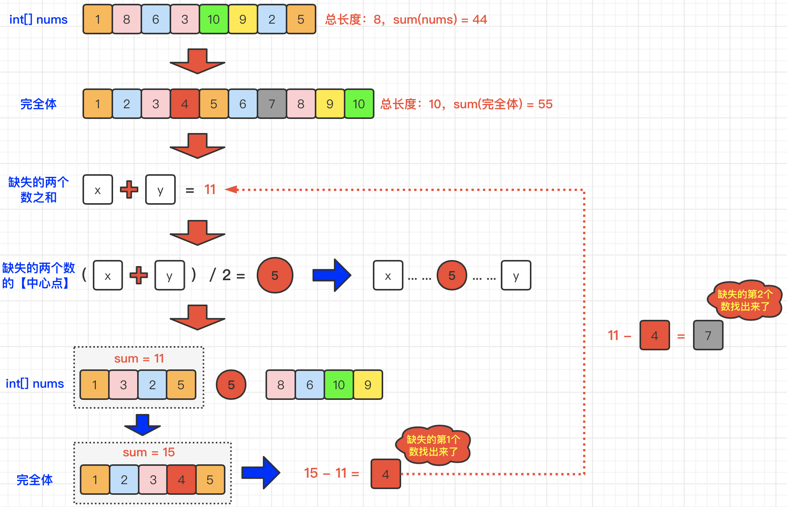

# 【力扣】面试题 01.08. 零矩阵

**题目：** 面试题 01.08. 零矩阵

**难度：** 中等

**提交时间：** 2022-09-30


### 问题描述

编写一种算法，若M × N矩阵中某个元素为0，则将其所在的行与列清零。

```示例 

示例 1：

输入：
[
  [1,1,1],
  [1,0,1],
  [1,1,1]
]
输出：
[
  [1,0,1],
  [0,0,0],
  [1,0,1]
]
示例 2：

输入：
[
  [0,1,2,0],
  [3,4,5,2],
  [1,3,1,5]
]
输出：
[
  [0,0,0,0],
  [0,4,5,0],
  [0,3,1,0]
]
```

>来源：力扣（LeetCode）
>链接：https://leetcode.cn/problems/zero-matrix-lcci
>著作权归领扣网络所有。商业转载请联系官方授权，非商业转载请注明出处。


### 解法

#### 方法一：模拟，遍历

 **思路与算法** 

用数学方法去解决这个问题，

1. 假设1...n没有缺失，则总和为sum = n * (n+1) / 2;

2. 实际总和可以通过遍历相加，得出的总和为cur，则缺失两个数的和mSum: mSum = sum-cur;

3. 算出两数的平均数avg = mSum / 2,两个缺失的数中有个数一定比avg小，设为x，则假设在1...avg中同一样假设没有缺失数，则总和为hSum = avg * (avg+1) /2;

4. 实际总和也可以通过遍历算出来，将所有比x小的数相加总和为hCur，则x=hSum-hCur;

5. 另一个数为 mSum-x;



>上述图解出自：https://leetcode.cn/problems/missing-two-lcci/solution/zhua-wa-mou-si-by-muse-77-pqe5/  如有侵权，请联系作者删除


**代码**

```java
class Solution {
    public int[] missingTwo(int[] nums) {
        int len = nums.length+2;
        int cur = len*(len+1)/2;
        for(int num : nums ){
            cur = cur - num;
        }
        int mSum = cur;
        int avg = sum/2;
        int hSum = avg*(avg+1)/2;
        for(int num : nums){
            if(num<=avg)
            hSum= hSum-num;
}       
            return new int[]{hSum,mSum-hSum} ;
    }
}
```

**执行结果**


### 总结

求缺失的两个数，是不是可以将这个数组在某处分成两部分，一部分缺失一个数的情况相对比较好计算，这就是用数学的思维来解决这个问题


### 深入研究

如果是缺失3个数，应该如何分析？


